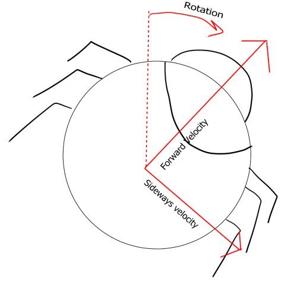
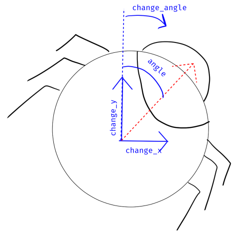

Beetle Battle Design Specification
==================================

Beetlebergs, being a game about beetles battling, needs to have a design for how those beetles battle. This is that
document.

The Battle
----------

### The Arena

The battle takes place in a square arena that is shown to the player from a 2D top-down view. As such, we can consider
it easily on the 2D coordinate plane. For programming purposes, remember that the origin (0,0) is at the lower left of
the screen, and the units of sprite locations as well as the units of sprite physics properties like `change_x` and
`change_y` are screen pixels. While there might be some convenience in moving the origin to the middle of the screen,
I think we can work just fine with it in the lower part of the screen.

There is no differentiation between different sections of the arena besides possible hazards laid by the beetles, though
this is obviously a possible area for new features. The area is bounded to the screen size, beetles cannot leave that
area. Projectiles will, however simply escape the bounds rather than bouncing.

### The Beetle

Each beetle is a round sprite with a certain facing. They use "tank movement" where they can move forward and backwards
based on their facing, and otherwise rotate their facing in either direction, clockwise or counter-clockwise. However,
it is possible a trait gained through evolution could allow them to "strafe" or "dodge" directly to the left and right.

Thinking of this from a physics modelling perspective, it would be ideal to keep track of a facing angle and a few basic
velocity vectors:

* Forward-backward velocity along the facing vector
* Rotational velocity
* Left-right sideways velocity perpendicular to the facing vector

These desired vectors can be seen in this diagram:

My first thought is that assuming the axes of `change_x` and `change_y` rotate along with `change_angle`, then both of
those would be fine to use here as the x-axis and y-axis would thus be local to the beetle. However, from a code
inspection it looks like those axes stay aligned with the global axes. While `change_angle` works OK for specifying
rotational velocity, the other two velocities will require some calculation from the `angle` attribute.

All the available sprite vector attributes are diagrammed here:

So the proposal is that we keep track of two scalar floats of speed, `forward_speed` and `sideways_speed`. Note that
these are scalar, not vector values, but that's OK because so are the sprite attributes. Essentially, we will convert
these speed values by finding the global x and y components of the vectors they describe based on `angle`. It might be
useful to show this process on a diagram:

While `forward_speed` and `sideways_speed` are scalars, the vectors they describe are drawn in green. We will have to
calculate the purple vectors that are the x and y components. Luckily, we can use basic trigonometry here. Take notice
of θ, which is 90 - `angle`. This makes sin(θ) equal to the length of the y-component of the forward vector divided
the length of the length of the forwards vector. We can reason likewise for the x-component and cos(θ). Putting this
together, and realizing that if θ is 90 - `angle`, then it is the other angle in the triangle, and thus we can just use
`angle` directly:

> `forward_x` = sin(`angle`) \* `forward_speed`
> `forward_y` = cos(`angle`) \* `forward speed`
> `sideways_x` = cos(`angle`) \* `sideways_speed`
> `sideways_y` = sin(`angle`) \* `sideways_speed`
> `change_x` = `forward_x` + `sideways_x`
> `change_y` = `forward_y` + `sideways_y`

Thus this is some pseudo-code for handling movement.

### The Projectiles

The projectiles are shot along the facing direction at regular intervals. There is likely a cooldown, the shot is fired,
and then a bullet particle is shot. If this bullet particle collides with an enemy beetle it does damage. Note, I say "enemy" beetle because I don't think we want friendly fire between the beetles.

These are the weakest attacks, made up by their continuous firing. Stronger attacks exist and are rewarded by beetles
acquiring traits.

### The Teams

The beetles are divided into two battling teams that start on opposite sides. By default there are three beetles in a
team, though team traits gained through evolution can add to that number. By default all the beetles in a team are
equal, though certain team traits may specialize a single beetle with a particularly powerful ability.

The battle ends when all the beetles on either team have been eliminated, making the other team the victor. It could
technically be possible for the two teams to be eliminated at the same time, but most likely one team over the other
would "win" based on when processing for each beetle occurs and when victory is awarded.

### The Traits

Each team has a set of traits. These traits apply to the beetles to change their capabilities. These traits may affect
the entire team of beetles as a whole, give a certain trait to all the beetles in a team, or give a certain trait to
a single beetle in a team.

Two of these traits are given to each team of beetles at the start of the match, but other traits may be added due
to progression of the beetles over battles.

### Beetle Specification

Beyond the above which just specifies the basic positioning of the beetle, I'm thinking we may want to create two
classes, `Beetle` and `Command`. The idea is that the basic stats of a beetle:

* HP
* Defense
* Offense
* Forward Speed
* Sideways Speed

are contained in the `Beetle` class as attributes, and then attacks and actions the beetle can take are in `Command`,
following the [Command design pattern](https://gameprogrammingpatterns.com/command.html). So then another attribute of
the `Beetle` class would be to be able to have a list of commands for it to take queued up in such a way that we can
have great freedom in designing beetle AI behavior.

Perhaps then there would be a `Projectile` or `Attack` class that handles running through the necessary creation and
update of any damaging particles.
