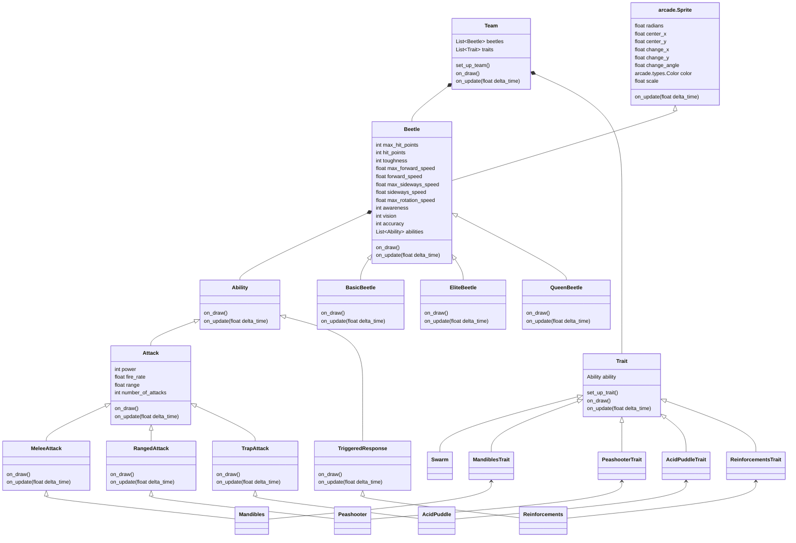
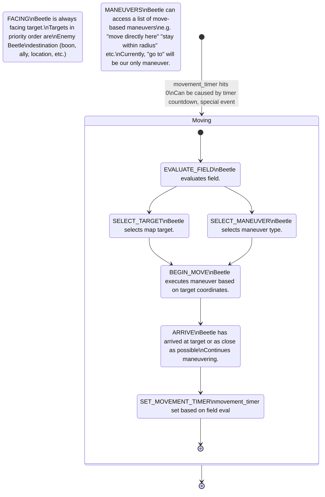
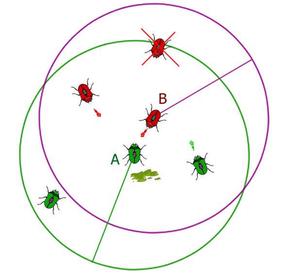

Beetlebergs Design Specification
================================

Legally Distinct Beetlebergs ("Beetlebergs" for short), is a game about beetles battling. Each the player attempts to
predict which of two teams of beetles will win the fight. After making their prediction, the team of beetles fight each
other, with no player input by default.

If the player guesses right, the losing team gains one new trait through evolution and one more beetle to give them an
advantage for the next fight. Then the game loop starts over again with the player making a new prediction for the next
round.

If the player guesses wrong, the game ends. Perhaps the player can have a certain number of wrong guesses before this
happens or another game over condition could be chosen.

So an example playthrough might go like this (with some possible features we have marked for future expansion):

1. The player starts the game.
2. Two beetle teams with a single trait are created randomly, and the player is asked to predict the winner.
3. The player predicts Team 2 will win.
4. The beetles battle and Team 2 does indeed emerge victorious!
5. The losing team, Team 1, gains one trait through evolution, and gets an additional basic beetle. The player is asked
   for their prediction for the next battle with the changed Team 1.
6. The player predicts Team 1 will win.
7. The beetles battle but to the player's surprise Team 2 somehow wins again!
8. Since the player's winning streak was only one round they are awarded with a low reward, and can choose to save the
   losing team, Team 1, to use in other modes or leave them to be devoured (and thus lost forever).
9. The player having no time for losers, leaves the team to be devoured, returning them to main menu, possibly with the
   chance to see some statistics of the battles they just saw before going there.

More in-depth details in this document. Note that there's a lot of overlap over rules, so sections of this document may
refer to rules that are fully explained in other sections.

Class Diagram
-------------

More details about these classes will be provided throughout this document. For `arcade.Sprite`, only the most relevant
attributes and methods are listed. Repetition of a inherited method implies a high likelihood that the class will need
to override it. Only a few example `Trait`s and `Ability`s are included.

Battle Rules
------------

When the battle begins, all the beetles (without player input) begin attacking each other with whatever attacks they
have available, causing damage to each other. When a beetle takes enough damage, it dies and is removed from further
action, though its in-flight projectiles remain deadly.

The battle ends when all the beetles on either team have been eliminated, making the other team the victor. It could
technically be possible for the two teams to be eliminated at the same time, but most likely one team over the other
would "win" based on when processing for each beetle occurs and when victory is awarded.

### The Arena

The battle takes place in a square arena that is shown to the player from a 2D top-down view. As such, we can consider
it easily on the 2D coordinate plane. For programming purposes, remember that the origin (0,0) is at the lower left of
the screen, and the units of sprite locations as well as the units of sprite physics properties like `change_x` and
`change_y` are screen pixels. While there might be some convenience in moving the origin to the middle of the screen,
I think we can work just fine with it in the lower part of the screen.

There is no differentiation between different sections of the arena besides possible hazards laid by the beetles, though
this is obviously a possible area for new features. The area is bounded to the screen size, beetles cannot leave that
area. Projectiles will, however simply escape the bounds rather than bouncing.

### The Teams

The beetles are divided into two battling teams that start on opposite sides. By default there are four beetles in a
team, though team traits gained over a playthrough can add to that number. By default three the beetles in a team are of
the Basic beetle type with one Elite beetle type. Over a playthrough more beetles, some of more powerful or specialized
types like the Queen, may be added to the team as traits are gained.

Note that by starting with an Elite beetle, this allows the team to use an Advanced-only Trait if that is what they
get through evolution after the first battle.

I propose we encapsulate this into a `Team` class that would have these basic attributes:

* `beetles`: A list of beetles (of various types) that the team gains at the start of a battle
* `traits`: A list of traits that either apply to that team as a whole, or will be given to the correct beetle(s) at the
  start of a battle

It's possible that it may be more flexible and simpler to only keep team-wide traits in `traits` or apply the traits
directly to the beetles as the team gains them. More on traits in a later section.

The Beetles
-----------

### Beetle Movement

Each beetle is a round sprite with a certain facing. They use "tank movement" where they can move forward and backwards
based on their facing, and otherwise rotate their facing in either direction, clockwise or counter-clockwise. However,
it is possible a trait gained through evolution could allow them to "strafe" or "dodge" directly to the left and right.

Thinking of this from a physics modelling perspective, it would be ideal to keep track of a facing angle and a few basic
velocity vectors:

* Forward-backward velocity along the facing vector
* Rotational velocity
* Left-right sideways velocity perpendicular to the facing vector

These desired vectors can be seen in this diagram:

My first thought is that assuming the axes of `change_x` and `change_y` rotate along with `change_angle`, then both of
those would be fine to use here as the x-axis and y-axis would thus be local to the beetle. However, from a code
inspection it looks like those axes stay aligned with the global axes. While `change_angle` works OK for specifying
rotational velocity, the other two velocities will require some calculation from the `angle` attribute.
Actually,`radians` is what we'll use in the code rather than `angle` because Python trigonometric functions like
`math.sin` take in radians. However, this explanation is easier to understand using `angle` which is in degrees.

All the available sprite vector attributes are diagrammed here:

So the proposal is that we keep track of two scalar floats of speed, `forward_speed` and `sideways_speed`. Note that
these are scalar, not vector values, but that's OK because so are the sprite attributes. Essentially, we will convert
these speed values by finding the global x and y components of the vectors they describe based on `angle`. It might be
useful to show this process on a diagram:

While `forward_speed` and `sideways_speed` are scalars, the vectors they describe are drawn in green. We will have to
calculate the purple vectors that are the x and y components. Luckily, we can use basic trigonometry here. Take notice
of θ, which is 90 - `angle`. This makes sin(θ) equal to the length of the y-component of the forward vector divided
the length of the length of the forwards vector. We can reason likewise for the x-component and cos(θ). Putting this
together, and realizing that if θ is 90 - `angle`, then it is the other angle in the triangle, and thus we can just use
`angle` directly:

> `forward_x` = sin(`angle`) \* `forward_speed`  
> `forward_y` = cos(`angle`) \* `forward speed`  
> `sideways_x` = cos(`angle`) \* `sideways_speed`  
> `sideways_y` = sin(`angle`) \* `sideways_speed`  
> `change_x` = `forward_x` + `sideways_x`  
> `change_y` = `forward_y` + `sideways_y`  

Thus this is some pseudo-code for handling movement.

### Beetle Movement Logic Diagram

Prototype proposal for movement logic. This is basically what will eventually replace the mouseclicks to move.

### Beetle Stats

Each beetle has a collection of stats that will be represented as attributes on the base `Beetle` class:

* `max_hit_points`: The maximum damage the beetle can take before being eliminated.
* `hit_points`: The current amount of damage the beetle can take before eliminated.
* `toughness`: How much, if any, damage is negated before it is applied to `hit_points`. In theory, this could also be a
  malus where a beetle takes _extra_ damage! A beetle will only have this by gaining it through a trait.
* `max_forward_speed`: How fast the beetle can move along the facing axis (possibly separate `max_backward_speed`?)
* `max_sideways_speed`: How fast, if at all, the beetle can move along the left-right axis perpendicular to the facing
  axis. A beetle will not have this by default, but gain it through a trait.
* `max_rotation_speed`: How fast the beetle can turn.
* `scale`: How large the beetle is, increasing its drawn size and thus its hitbox. (Actually part of `arcade.Sprite`.)
* `awareness`: The beetle's ability to keep track of important features around it. Higher awareness allows it to
  consider more important features, as well as have more patience in aiming its shot. (This requires some
  explanation...)
* `vision`: How far the beetle can "see", which controls what things it's able to include in its awareness.
* `accuracy`: How good the beetle is at aiming projectiles. This is implemented as an amount of random "skew" on their
  shots, with higher `accuracy` having less skew.

#### Beetle Awareness

As mentioned `awareness` needs a bit more explanation of what it means. Beetles need to keep track of a few important
features on the battlefield. For example, they need to track enemy locations, incoming enemy projectiles, hazard
locations, and nearby allies. Another idea that we are thinking will make for very interesting behavior is that beetles
do indeed _try_ to aim at enemies and but are limited in how their shots are _timed_ based on their awareness. Let's
describe the second first, as that is less involved.

Usually, a beetle will fire its Ranged attacks on a regular cadence, just as soon as when the cooldown expires. This is
good and creates a lot of randomness, so we don't want to get rid of it. However, it would be nice if that _sometimes_
the beetle is a bit more patient, waiting to fire a shot when it knows it's facing an enemy. And that ability to be
patient is tied to `awareness`. A less aware beetle will have less time to line up an aimed shot before it gets
over-eager and fires. Note that the beetle is still limited by its `accuracy`, which adds a random skew to their shots.
There will likely need to be tuning to get the right level of successful hits versus misses.

The other aspect of `awareness`, that applies when the beetle is making decisions on what to do, is how much of the
battlefield the beetle can keep in mind. The types of features that the beetle may want to consider are as follows:

* Friendly beetles: How many and what kind of other allied beetles are nearby. This is important for the beetles to use
  abilities such as Pheromones, where there is a benefit to staying close to an Advanced beetle.
* Boons: This mostly comes in play with the Cannibal Trait, but these are features of the battlefield that if
  gained would provide a benefit. In the case of Cannibal, this can represent larvae and beetle corpses which provide
  HP when collected by a beetle with the trait. Other boons are definitely possible though!
* Hazards: The opposite of Boons, these are features of the battlefield that would cause damage if collided with.
* Projectiles: A bit like Hazards in that they cause damage, but these are (enemy?) projectiles that must be avoided. It
  is an open question of if there will be too many projectiles to have here. It may be necessary to prune the list of
  projectiles down to those likely to hit the current beetle, and it may be interesting to have the `awareness` stat
  affect the ability to do that.
* Enemy Beetles: How many and what kind of enemy beetles are nearby. This is obviously important for both attacking and
  defense.

Given a list of these, a beetle will of course want to have a priority order for what features it should respond to
first. A beetle should usually be more worried about avoiding a projectile than picking up a boon, for example. This
priority order will of course need to be manipulated by us as we find good behavior for what we like, but it is also
possible that eventually a player can manipulate this order as a reward, making their beetles more aggressive but thus
more likely to be killed, for example.

Working along with this, the idea is that higher `awareness` lets a beetle consider more of these features to respond
to as it's making decisions. So let's say an unaware beetle can only keep track of 3 things. The beetle would
tally up and sort all of the features by their priority order, but in the end only be able to respond to the 3 most
important things (or perhaps the 3 closest things?). A more aware beetle can increase this to 5, or 7 or so on, being
able to account for more features.

This also interacts with `vision` in that beetles can only be aware of what's in a certain radius that increases as
their `vision` goes up. However, note that a longer vision is not necessarily a benefit if that drives the beetle to
chase off for distant boons, ignoring close dangers. Nonetheless, this should make for interesting behavior that we can
tweak to our hearts' delight.

It may end up being worth combining `awareness`, `vision`, and `accuracy` into one stat to make things simpler, but we
suspect that will be borne out as we play around with the values, so for now having extra knobs to play with seems
helpful.

##### An Example of Beetle Awareness

As an example of how this may work out, notice this diagram:

In this diagram are two beetles on opposing teams. Beetle A is on the green team, and Beetle B is on the red team.
Further, Beetle A has the Cannibal trait. Besides those two beetles, there are two more green beetles and two more red
beetles (one of which is dead, represented by being crossed out with an X). There are also two red projectiles, one
green projectile, and an acid puddle hazard.

So Beetle B could ideally be aware of six things:

* The live red ally
* The one green projectile
* The three live green enemies
* The single acid puddle

On the other hand, Beetle A, with its Cannibal ability would be ideally aware of eight things:

* The two green allies
* The single acid puddle
* The two red projectiles
* The two live red enemies
* The dead red beetle that it can eat as a boon

As an example, let's say the beetles have this priority order, though they discount based on distance:

* Projectiles
* Enemies
* Hazards
* Boons
* Allies

And then let's say each of Beetle A and Beetle B were stuck with such a low awareness that they could only keep _one_
thing in mind. They would both only be aware of the closet projectile to them, and would seek to avoid being hit by it.

If they had higher awareness and consider _two_ things, Beetle A could now consider _both_ projectiles, and Beetle B
could now consider the closest green beetle. Beetle B could possibly decide that the single projectile is worth the
chance to fire at the closest green beetle and choose to take a shot instead. It could of course still decide to focus
on avoiding the shot.

If now they could consider _three_ things, Beetle A can now account for one of the enemies, and Beetle B can consider
two of the enemies. Thus Beetle A may make the same choice to fire at the enemy (though it would likely be better off
focusing on the two projectiles, in my opinion), and Beetle B can chose which of two enemies would be safer to try to
attack.

At _four_ things, Beetle A now considers the two projectiles and the two live enemies, and perhaps Beetle B can now
consider the acid puddle as despite it being lower priority, it's much closer.

At _five_ things, Beetle A can finally possibly consider the dead red beetle (or alternatively focus on the closer
allies), while Beetle B can consider all the green beetles, the green projectile, and the acid puddle (assuming it
doesn't trade out the distant green beetle for a nearer ally).

We can go further from here, but this is a good example for how beetle awareness may come into play.

### Beetle Types

Beetles can be further specialized into types, with two "advanced" types of beetles. These should be implemented as
subclasses of the base `Beetle` class. The base stats for each type of beetle will be given as multipliers, which may
not match how we show this to the player in game. For example a `BasicBeetle` may have a size of 1, and then
an `EliteBeetle` has a size of 1.3, but this could show up in game as 39 and 51 respectively. And of course, we may
need to set certain values as constants in our code which may be even more different.

To save some typing the advanced `EliteBettle` and `QueenBeetle` will only have the differences from the `BasicBeetle`.

* `BasicBeetle`: The default Basic Beetle that we start out with. Might could just use the `Beetle` class for this.
  * `max_forward_speed`: 1
  * `accuracy`: 1
  * `max_rotation_speed`: 1
  * `max_hit_points`: 1
  * `toughness`: 0
  * `scale`: 1
  * `awareness`: 1
* `EliteBeetle`: A more powerful Elite Beetle, who is larger and has more `max_hit_points` and is eligible to gain certain
  traits
  * `max_hit_points`: 1.5
  * `scale`: 1.3
* `QueenBeetle`: A smaller, less aware Queen Beetle that can't attack itself, but spawns larvae that if left alone will
  grow into Basic Beetles. Enemy beetles may gain a trait that allows them to devour larvae before they can become Basic
  Beetles.
  * `accuracy`: 0 (to represent its inability to attack)
  * `scale`: 0.8
  * `awareness`: 0.8

### Beetle Attacks

As this is game of battling, the beetles of course will need ways to attack each other. Each non-Queen beetle starts
with a basic primary attack that fires a small projectile along the beetle's facing usually continually, but they may
gain a secondary attack through Traits.

Attacks can be divided into a few basic categories:

* Melee: Apply when a beetle collides with another beetle, either from the front or rear. It may cause effects on the
  hit beetle such as knockback or stunning. Example flavor ideas:
  * mandibles
  * pincers
  * claws
  * stingers
* Ranged: Shoot one or more projectiles that travel across the screen from the attacking beetle. The projectiles may
  have a hurt box the entire time or only cause damage at certain points of their existence. Example flavor ideas:
  * spores
  * bullets
  * spikes
  * sprays
  * streams
* Trap: Release a trap such as acid or webs that stay on the battlefield and affect beetles that come into contact with
  it. These may only affect enemy beetles, or all beetles and may or may not be cleared when collided with. Example
  flavor ideas:
  * parasites
  * acid
  * goo
  * webs
  * lures

Additionally each attack can be thought of having the following attributes:

* `power`: the damage done when the attack hits
* `fire_rate`: how often the attack fires
* `range`: works differently for each category:
  * for Ranged attacks, how far the projectile travels before being despawned
  * for Trap attacks, how far away a beetle must be to trigger the trap
  * inapplicable for Melee attacks, which only fire on collision, though perhaps this could set the distance collision
    is considered at
* `number_of_attacks`: works differently for each category:
  * for Ranged attacks, the number of projectiles fired
  * for Trap attacks, the number of traps spawned
  * for Melee attacks, the number of hits of damage the attack makes when triggered

Actual details about how these attacks will be implemented as `Ability` classes are in the next section.

Traits and Abilities
--------------------

By default beetle behavior is to try to face enemies and fire their primary attack continually. Given their `awareness`,
they may also try to dodge incoming projectiles. This behavior can be modified through Traits, which change features of
the beetle or give a secondary attack to a beetle. However, such Traits are more of the way the player sees it and from
our perspective as coders, it would likely make sense to handle these Traits differently based on how and when these
traits are applied to the beetles.

There are five basic categories that the Traits can be divided into:

* Team Composition Traits: These Traits change the team make up, adding more beetles, which may be Advanced or replacing
  Basic beetles with Advanced beetles. Sometimes these Advanced beetles may start with certain Traits already given.
* Stat Change Traits: These Traits change the stats of beetles. They usually affect all beetles on the team but may
  affect only the Advanced beetles. Note that the changes may not be all positive!
* Secondary Attacks/Abilities: These Traits give the beetle a secondary attack.
* Attack Boosts: These Traits modify how the attacks of the beetle work. They may affect just the primary attack, just
  the secondary attack (if any), or both attacks (if able).
* Triggered Responses: These Traits only come into effect when certain conditions such as taking damage, the current
  position of the beetle in relation to other beetles, or teams reaching certain numbers of beetles remaining.

Thus, it may make the most sense to divide these Traits further into `Trait`s that are applied before battle, and
`Ability` Traits which come into play during battle, which would include the attacks and the triggered responses.

So when a battle begins, the code should go through the `traits` attribute of each team, and use that to create new
instances of the team's beetles, possibly with particular `Ability` instances added to the beetle's `abilities`
attribute. Each `Trait` would have an `set_up_trait` method that is called when the battle is being set up to handle
this behavior for that trait. Note that certain Traits may only be applied to Advanced beetles, so their `set_up_trait`
method should take that into account.

For the `Ability` classes, instead there is an `on_update` method that is called every frame to let the `Ability` handle
its own behavior. Even the basic behavior and the special queen behavior can be implemented as certain `Ability`
classes.

Ranged Attack `Ability` classes will have an `on_update` that spawns a projectile and then goes into cooldown
until it's time to spawn another projectile. Trap Attack `Ability` classes will behave similarly to Ranged Attacks. Both
Ranged Attacks and Trap Attacks will essentially spawn their own `Projectile` and `Trap` game objects that will have to
have `on_update` methods to handle their behavior and thus will likely inherit from the Arcade `Sprite` class.

Melee Attack `Ability` classes will an `on_update` that checks for collision with another beetle and causes damage if
any are correctly collided. There may be a cooldown for Melee attacks where it will not immediately cause damage.

Triggered Response `Ability` classes will have an `on_update` that checks if it should be triggered, and then enacts the
effect if it should be.

There are also two special `Ability` classes, the Queen's ability to spawn larvae, which can be thought of as a special
Trap Attack, and the `Cannibal` class which allows the beetles with it to devour larvae or dead beetles to regain
energy, which can be thought of as a special Triggered Response `Ability`.

Note that `Ability` and `Trait` classes should both consider if their effects can even be applied. For example, a
`Trait` that provides a boost to the secondary attack needs the beetle to _have_ a secondary attack to apply. As an
additional concern, certain `Trait`s and `Ability`s may only be applicable to certain types of beetles. This is probably
easiest implemented with an `acceptable_types` flag enumeration attribute.

Implementing `Trait`s and `Ability`s as small shared classes follows the
[Flyweight design pattern](https://gameprogrammingpatterns.com/flyweight.html), and should be highly performant and
make for very self-contained code.

### MVP Trait List

Note that rather than nailing down numbers now, we should decide this based on experimentation, so lots of specific
numbers have been replaced with variables like "X"

* Team Composition Traits
  * Swarm: Adds X new Basic beetles to the team
  * Elite: Adds new Elite beetle to the team
  * Queen: Adds new Queen beetle to the team
  * Soldier: Adds a single new Elite beetle to the team, starting with the Mandibles Trait and an attack bonus
  * Metamorphosis: Replaces one or more Basic beetles with Elite beetles
* Stat Changes
  * Dodge: Gives beetles a chance to dodge incoming projectiles based on their `awareness`. Additional gains make
    dodging more likely
  * Swift: Increases `max_forward_speed`
  * Small: Decreases `scale`
  * Gigantism: Increases `scale`
  * Quick-turn: Increases `max_rotation_speed`
  * Sniper: Increases `accuracy`
  * Higher Perception: Increases `awareness`
  * Armor: Increases `toughness` of Advanced beetles
* Attack Boosts
  * Primary ++: Increases `number_of_attacks` for primary attack
  * Secondary ++: Increases `number_of_attacks` for secondary attack
  * Primary Power: Increases `power` for primary attack
  * Secondary Power: Increases `power` for secondary attack
  * Fire Rate: Increases `fire_rate` for all attacks
  * Farsight: Increases `range` for all Ranged attacks
* Unique Attacks/Abilities
  * Peashooter: basic primary attack, fires a small bullet in the current facing of the beetle
  * Fecund: Only for Queen beetles, Trap attack that spawns larvae that eventually become Basic beetles
  * Cannibal: Triggered Response that fires when the beetle collides with beetle corpses or larvae, consuming it,
    healing HP and increasing size
* Secondary Attacks/Abilities (all Elite only)
  * Bombardier: adds secondary Ranged attack that travels in an arc and causes damage in an area-of-effect upon landing
  * Missileer: adds secondary Ranged attack that moves in a straight line that can hit others before reaching the end
  * Mandibles: adds secondary Melee attack that hits in the front of the beetle, doing strong damage and causing
    knockback
  * Pincers: adds secondary Melee attack that hits in the rear of the beetle, doing weak damage but causing a stun
    effect (perhaps stun affect can be implemented as an `Ability`?)
  * Stinger: adds secondary Melee attack that hits in the rear of the beetle, doing strong damage that repeats as long
    as collision continues
* Triggered Responses
  * Acid blood: Triggers on damage, causing damage to enemy beetles within in a certain radius who are splashed by the
    blood
  * Nova: Triggers on beetle death, sending out several shots all around that can damage enemies they hit
  * Ninja: Triggers when hit by an enemy attack with a certain likelihood a single time per battle, causing the beetle
    to teleport behind the attacker setting the primary attack cooldown to 0 so that it occurs immediately
  * Intimidating: Triggers when the opposing team has no more Advanced beetles, giving stat bonuses to all or most
    beetle stats
  * Scrappy: Triggers when the opposing team has more beetles, increasing `max_forward_speed` and `awareness`
  * Reinforcements: Triggers when the team has 3 or fewer beetles, spawning X Basic beetles from offscreen
  * Elite Reinforcements: Triggers when the team has 3 or fewer beetles, spawning an Elite beetle from offscreen
  * Pheromones: Triggers when Basic beetles are near an allied Advanced beetle, increasing `accuracy`,
    `max_rotation_speed` and changing behavior to focus fire on attackers of the Advanced beetle

Development Milestones
----------------------

* First basic beetle coded (minimum: movement/turning, attack cycle)
* First evolution created & implemented (basic beetle can take in evolution, evolution changes beetle behavior
  accordingly)
* Special beetles implemented (Queen, Elite, ??)
* First successful 1v1 battle round from start to finish, & first successful many-v-many battle round from start to finish
* Special behaviors implemented: larvae spawning, cannibal feeding, teleporting(?), anything that isn't basic
  movement/turning & attack cycle)
* First successful alpha-complete(?) game from round 1 to round n: evolutions, determination of win/loss, etc.
* Creation of player profile/data (to store/track unlocks, metrics, and progress)

Possible Additional Features
----------------------------

As a MVP (Minimum Viable Project) we are focused on the "basic" mode described above where two teams of beetles fight.
However, it is worth listing some other possible features for future extension after that:

* More types of bugs rather than beetles, with their own different stats and evolutions
* Additional ways beetles can move, perhaps flying, burrowing or swimming
* As the battle continues on too long, the arena begins closing in on the beetles
* Traits which affect beetle behavior such as:
  * Making beetles move towards or way from friendly/enemy beetles
  * Avoiding enemy fire through movement or dodging
  * Improving the accuracy of attacks
  * Terror: When all enemy Advanced beetles are killed, the other team will flee battle, immediately ending the battle
* Team saving
  * Saving the _losing_ team could be a choice made at the end of a basic mode battle versus
    letting the winning team (or the player?) devour the losing team (for a benefit or increased health maybe?)
* Versus Mode: Saved teams from the basic mode or player-designed teams fight one-off battles
* Tournament Mode: Like Versus Mode, but over a bracket with multiple teams
* Breeding Mode: Saved teams can be bred together producing a new team with a mix of the traits and perhaps a chance
  a chance to mutate wholly new traits
* Player Input in Battles: It would be cool if the player had more power in the battles, but there will likely need to
  be care taken with how this interacts with the switching of teams for voting/control
  * A certain number of resources (perhaps 3) that allow the player to direct the beetles to move to a certain location
  * Rather than just leaving the player to enjoy betting, perhaps successful bets or long betting streaks can also
    provide a reward that can be used to make the winning team (or the losing team?) more powerful. Something like
    evolution points that can be spent. These could also be applied in other modes, perhaps to unlock different bug
    types or be able to create more powerful custom teams.
    * Other possible rewards include:
      * Being able to start with advanced beetle types such as the queen or elite
      * Being able to change the number of traits each team starts with
      * Being able to grant an additional trait to a team of their choice before a battle begins
      * Unlocking more slots for custom or saved teams
      * Unlocking player control abilities
  * A special beetle type that allows basic control of that single beetle, with the other beetles generally following
    along. This would likely be the Queen subtype, which if so, then as a balance, the player also has to manually spawn
    larvae
  * Being able to assign team strategies, such as:
    * increasing the aggression with which attacks are made versus taking a more neutral or defensive posture
    * focusing fire on a location or beetle
    * Using special abilities over basic attacks
